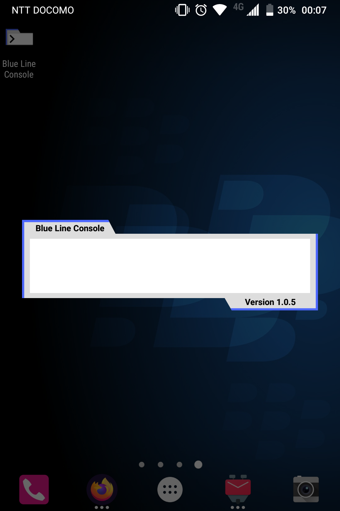
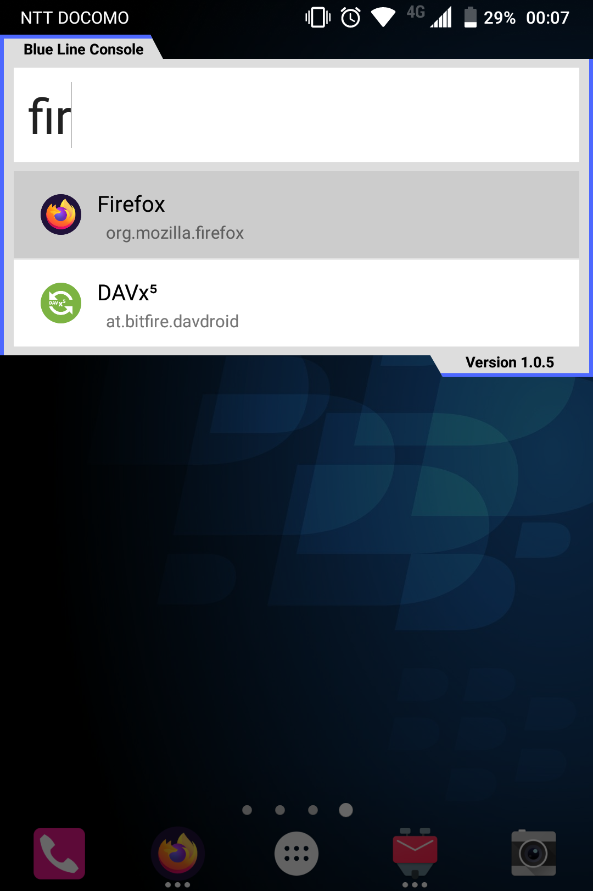
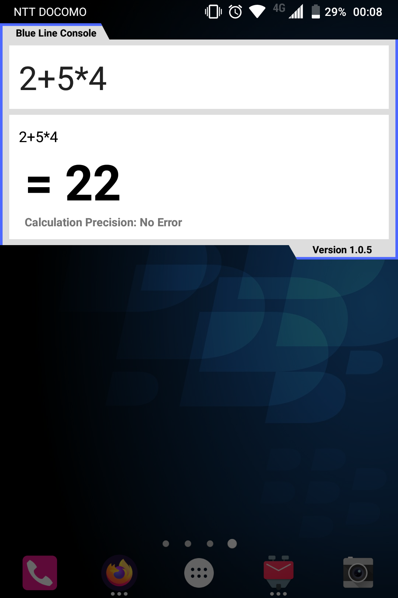

##  Iris Line Console

Keyboard based launcher for Android

### 基于原项目二次开发

本项目基于 [Blue Line Console](https://github.com/nhirokinet/bluelineconsole.git) 二次开发，遵循 Apache License 2.0 协议。

原项目版权信息：

- 原作者：nhirokinet
- 原项目地址：<https://github.com/nhirokinet/bluelineconsole.git>
- 协议：Apache License 2.0

### 协议说明

根据 Apache License 2.0 协议，本项目保留了对原项目的修改和再分发权利，同时保留了原项目的版权声明。

Apache License 2.0 协议要求：

- 保留版权声明和许可声明
- 说明对代码所做的变更
- 在需要时提供 NOTICE 文件（本项目通过 README.md 提供相关信息）

### Releases

Available at:

- (TBD)

### Screenshots

  

### Class 功能使用说明

Class 功能允许您创建应用类别，将相关应用组织在一起，方便快速访问。

#### 如何使用 Class 功能：

1. **创建类别**：
   - 在命令界面输入 `config `并选择 "class" 选项
   - 点击 "添加" 按钮
   - 输入类别名称和显示名称
   - 选择要包含在该类别中的应用
   - 点击 "保存" 完成创建
2. **编辑类别**：
   - 在命令界面输入 `config `并选择 "class" 选项
   - 点击要编辑的类别
   - 修改类别名称、显示名称或包含的应用
   - 点击 "更新" 完成编辑
3. **使用类别**：
   - 在命令界面输入c\_类别名称即可快速访问该类别中的应用
   - 类别会显示其包含的应用数量

#### Class 功能特点：

- 每个类别可以包含多个应用
- 类别有唯一的名称和用户友好的显示名称
- 支持通过命令界面快速搜索和访问类别

